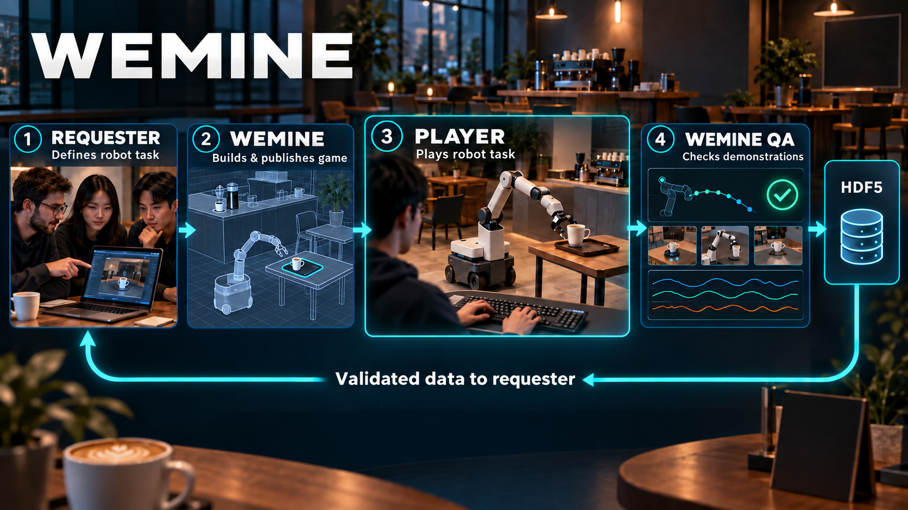

# WEMINE

**Play a robot task. Capture useful robot data.** A requester describes the virtual robot task and data they need. WEMINE builds and publishes the game for a separate player to play, then validates the demonstration and delivers data back to the requester. In this hackathon pilot, the player controls a mobile robot arm in a café to move a coffee mug onto a tray.

> **Start here:** the requester console is at **http://127.0.0.1:8000** and the playable MuJoCo game is at **http://127.0.0.1:8010/?role=player**. They are separate local servers; run both for the full demo.

## The idea in one minute

1. A **requester** describes a robot, task, environment, data format, and episode count in plain language.
2. **Agents** turn that request into a checked specification and a café scene plan. The requester approves it.
3. A **player** controls a PandaOmron robot in the browser. The MuJoCo game records actions, simulator states, and camera observations in an HDF5 episode.
4. **Code-based QA** checks the recording and replays it; an agent writes the QA report. The requester can inspect the result, quote, and downloadable files in the console.

The core loop is **task request → playable simulation → human demonstration → replay and QA → robot data**. The pilot's café task is `CafeServeCoffee`; it is a simulation demo, not evidence that a policy has transferred to a physical robot.

## Run the demo locally

**Prerequisites:** Python 3.11, Git, and a modern desktop browser. The requester console needs only the small Python dependencies below. The 3D game also needs MuJoCo, RoboCasa, RoboSuite, and downloaded kitchen assets; see [one-time game setup](#one-time-game-setup) for a fresh clone. The setup is substantial and needs roughly 25 GB of free disk space.

```bash
git clone https://github.com/Sehyeogkim/cloudfare_0928.git
cd cloudfare_0928
python3.11 -m venv .venv
source .venv/bin/activate
python -m pip install -r requirements.txt
```

**Terminal 1 — start the game** (after the one-time game setup):

```bash
sim/.venv/bin/python sim/web/server.py
```

Open **http://127.0.0.1:8010/?role=player** to play the café task directly. Click inside the game view to focus keyboard controls.

**Terminal 2 — start the WEMINE console:**

```bash
source .venv/bin/activate
AGRIPHILO_GAME_SERVER_URL=http://127.0.0.1:8010 python -m agriphilo.web --demo
```

Open **http://127.0.0.1:8000**, use the demo sign-in, then choose **Data requester** to create an order or **Player** to browse available games. In the requester console, choose the café example, approve the specification, open the player view when the scene is ready, submit an episode, and continue through QA and delivery. `--demo` uses scripted agents and needs no Brainbase key. Stop either server with `Ctrl+C`.

| Control | Action |
| --- | --- |
| `W` `S` / `A` `D` / `R` `F` | Move the arm forward/back, left/right, up/down |
| `Q` `E` / `Z` `C` | Rotate the wrist |
| `Space` | Open or close the gripper |
| `Shift` + movement | Fine control |
| `I` `K` / `J` `L` / `U` `O` | Move or rotate the mobile base |

Use **Reset** to retry and **Submit episode** to save a demonstration. The server writes HDF5 files under `runs/episodes/`.

### One-time game setup

The large upstream simulation assets are intentionally excluded from Git. From the repository root, create the game environment, install the two pinned upstream source versions, and download RoboCasa's kitchen assets:

```bash
python3.11 -m venv sim/.venv
git clone https://github.com/ARISE-Initiative/robosuite.git sim/third_party/robosuite
git -C sim/third_party/robosuite checkout 5ce6643f3092639d08f7b0f90ed1c6a84f50552c
git clone https://github.com/robocasa/robocasa.git sim/third_party/robocasa
git -C sim/third_party/robocasa checkout 456174f62b89b8fca99eaaf33949c29fec9cfc2a
sim/.venv/bin/python -m pip install -e sim/third_party/robosuite -e sim/third_party/robocasa fastapi uvicorn
sim/.venv/bin/python -m robocasa.scripts.setup_macros
sim/.venv/bin/python -m robocasa.scripts.download_kitchen_assets
```

The game uses offscreen rendering. `sim/web/server.py` defaults to `MUJOCO_GL=cgl` on macOS; on a Linux host with EGL, launch it with `MUJOCO_GL=egl sim/.venv/bin/python sim/web/server.py`. The first connection may take time while the simulation initializes.

## How the prototype is built

| Layer | Implementation |
| --- | --- |
| Request and orchestration | Python HTTP server, Pydantic contracts, Brainbase agents or scripted demo agents |
| Game | Browser controls and streamed JPEG views from a MuJoCo/RoboCasa café simulation over WebSocket |
| Demonstration record | `collect_demos`-style HDF5 with simulator states, actions, metadata, and camera observations |
| Validation | Deterministic checks and replay in `agriphilo/game_qa.py`, plus a readable QA report |
| Delivery | Manifest, dataset, QA report, and quote in the requester console |

The default background episode worker in the console is a **scripted mock**. Its synthetic episodes demonstrate pipeline wiring, not a trained AI player or real robot performance. Human game episodes come from the separate MuJoCo server. Credits and checkout shown in demo mode are test flows.

## Repository map

| Path | Purpose |
| --- | --- |
| `agriphilo/web.py`, `agriphilo/static/` | Requester and player pages, local API |
| `agriphilo/agents/`, `agriphilo/pipeline.py` | Specification, orchestration, QA, quote, and order state |
| `sim/cafe/cafe_env.py` | Custom café task |
| `sim/web/server.py`, `sim/web/static/` | Playable MuJoCo server and keyboard UI |
| `agriphilo/game_qa.py`, `agriphilo/collection.py` | Episode validation and packaging |
| `examples/` | Sample café requests |

For real Brainbase agent calls, set `BRAINBASE_API_KEY` in a local `.env` and start `python -m agriphilo.web` without `--demo`. The game server still runs separately. See [sim worker contract](docs/sim_worker.md) for the optional external worker integration.
