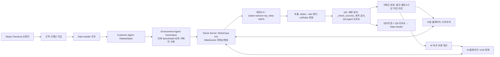
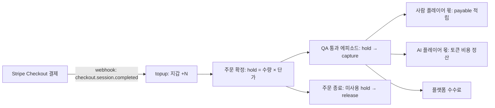

# Agriphilo 게임 플랫폼 계획 (RoboCasa 기반)

> 2026-09-28. 이 문서는 "데이터 수요자가 주문하면 에이전트가 게임을 만들고, 사람/AI 플레이어가 로봇이 되어 플레이하며, 추출·QA를 통과한 데이터만 크레딧이 되는" 플랫폼의 구현 계획이다. 3시간 Three.js 데모 계획([../plan.md](../plan.md))과 Isaac 계획([plan_isaac_2026-09-28.md](plan_isaac_2026-09-28.md))을 대체한다. 실행 결과와 품질 검증 상태는 별도로 확인한다.

## 1. 한 줄 정의

**주문 → 게임 → 플레이 → 추출 → QA → 크레딧.** 두 종류의 고객이 있다.

| 고객 | 주는 것 | 받는 것 |
| --- | --- | --- |
| Data needer (customer 1) | Stripe로 선충전한 크레딧, 가상환경 요구, 로봇 스펙, 원하는 데이터 종류, 필요 수량 | QA 통과 에피소드 데이터셋 (HDF5 / LeRobot) |
| Player (customer 2, 사람 또는 AI) | 플레이 시간과 조작 | 사람: QA 통과 에피소드당 크레딧 (데모는 TEST MODE). AI: 크레딧이 LLM 토큰 비용으로 쓰임 |

## 2. 왜 RoboCasa/MuJoCo인가

`sim/robocasa`에서 확인한 사실:

- 주방 장면 120개(layout × style), 과제 다수, `_check_success()`로 **과제 성공을 코드가 판정**한다.
- `scripts/collect_demos.py`가 키보드/스페이스마우스 teleop을 이미 지원하고, `DataCollectionWrapper`로 **states + actions**를 HDF5에 남긴다.
- `dataset_scripts/dataset_states_to_obs.py`가 저장된 states에서 카메라 관측을 **사후 렌더**하고, `convert_hdf5_lerobot.py`가 LeRobot 포맷으로 바꾼다. `playback_dataset.py`로 재생 검증이 가능하다.
- robosuite 로봇(Panda, PandaOmron 등)을 옵션으로 바꿀 수 있어 "로봇 스펙" 주문을 매핑할 수 있다.

즉 **게임 엔진 = 데이터 파이프라인**이라 재현성, 성공 판정, 포맷 문제를 새로 풀지 않아도 된다. Three.js 도형 데모는 물리·로봇 모델이 없어 구매자에게 팔 수 없고, Isaac Sim은 RunPod UDP 제약으로 브라우저 플레이가 어렵다.

## 3. 아키텍처

**구현 위치**: 현재 저장소. 시뮬레이터는 `sim/`(RoboCasa, robosuite), 플랫폼 코드는 `agriphilo/`. 기존 Customer/Environment/QA/Payment 에이전트와 Pydantic 계약을 그대로 확장한다. 시뮬레이터는 서버(Python)에서만 돌고, 브라우저는 프레임을 받아 그리고 입력만 보낸다(클라우드 게임 방식). MuJoCo WASM 이식은 RoboCasa 에셋이 무거워 후순위.

## 4. 데이터 계약

### GameSpec (Environment Agent 출력, 코드 검증)

`task`(RoboCasa 과제명), `layout_ids`, `style_ids`, `robot`(robosuite 이름), `cameras`(이름·해상도·fps), `control_hz`, `max_steps`, `episodes_requested`, `success_rule`(RoboCasa 기본 판정 + 시간 제한), `credit_per_pass`, `base_seed`. 기존 `EnvironmentPlan`의 `greenhouse_tomato_v1` 고정값을 이 구조로 일반화한다.

### Episode (Game Server 출력)

RoboCasa 저장 형식 그대로: `states`, `actions`, `actions_abs`, `ep_meta`(lang, layout, style, seed). 여기에 플랫폼 필드 추가: `player_id`, `player_kind`(human/ai), `input_device`, `wall_time`, `client_version`. **원본은 states+actions이고 이미지는 사후 렌더 산출물**이라 해상도·카메라 변경, 위조 검출이 사후에 가능하다.

### QA 판정 (코드가 측정, 에이전트는 해석만)

1. 재생 일치: 초기 state + actions를 다시 실행해 최종 state가 저장값과 일치.
2. 과제 성공: `_check_success()` 참, 시간 제한 내.
3. 궤적 검사: 관절 속도 한계, 정지 구간 비율, 최소 길이, 중복 에피소드(해시) 제거.
4. QA Agent: 측정치를 읽고 리포트와 불합격 사유 작성. 수치는 만들지 않는다.

## 5. 플레이어

- **사람**: 브라우저 `/play/<game_id>`. 서버가 20Hz로 JPEG 프레임을 WebSocket으로 보내고, 키보드/게임패드 입력을 받아 robosuite `Keyboard` 장치와 같은 매핑으로 행동 벡터를 만든다. 화면에 과제 문장(`ep_meta.lang`), 남은 시간, 예상 크레딧 표시.
- **AI**: 같은 WebSocket 프로토콜을 쓰는 Python 클라이언트. VLM(Claude)에게 현재 프레임 + 과제 문장 + 최근 행동을 주고 다음 행동(이산 키 조합 또는 EE delta)을 받는다. 느려도 되므로 서버가 AI 턴을 기다리는 동기 모드로 돈다. AI 에피소드는 `player_kind=ai`로 표시하고 별도 단가를 적용한다.

## 6. 크레딧 (Stripe 선충전)

**원칙: 고객이 먼저 충전하고, QA를 통과한 데이터만큼만 차감한다.** 크레딧 1개의 원화·달러 환율은 고정하고, 잔액은 Stripe가 아니라 우리 원장이 관리한다. Stripe는 돈이 들어오고 나가는 곳에만 쓴다.

### 원장 항목

원장은 추가만 하는 JSON/SQLite 기록이다. 잔액은 항목 합으로 계산하고, 직접 수정하지 않는다. 기존 `game_qa.record_credits`(통과 에피소드 적립, 중복 방지)를 이 구조로 확장한다.

| 종류 | 발생 시점 | 계정 변화 |
| --- | --- | --- |
| `topup` | Stripe webhook 확인 후 | 고객 지갑 +N |
| `hold` | 고객이 GameSpec 견적 승인 | 지갑 가용액 → 주문 보류액 |
| `capture` | 에피소드 QA 통과 | 보류액 −단가 |
| `payout_accrual` | capture와 같은 트랜잭션 | 사람 플레이어 payable +몫 |
| `token_cost` | AI 에피소드 종료 | 실제 LLM 사용량을 크레딧으로 환산해 기록 |
| `fee` | capture와 같은 트랜잭션 | 플랫폼 수익 +몫 |
| `release` | 주문 완료·취소 | 남은 보류액 → 지갑 가용액 |
| `refund` | 고객 요청 | 지갑 −N, Stripe Refund |

모든 항목에 `idempotency_key`(Stripe event id 또는 `episode_id`)를 둬 webhook 재전송과 QA 재실행에서 이중 기록을 막는다.

### 단가 배분

에피소드 단가 = 플레이어 몫 + QA·렌더·학습 비용 + 플랫폼 수수료. 요율표는 기존 `agriphilo/pricing.json`에 둔다.

- **사람 플레이어:** 몫을 payable로 쌓고, 최소 금액 이상이면 지급한다.
- **AI 플레이어:** 실제 토큰 사용량을 `token_cost`로 기록한다. **통과 에피소드 1개당 토큰 비용이 AI 몫보다 크면 적자**이므로, 불합격 에피소드의 토큰 비용도 통과분에 나눠 계산한다. 이 비율이 AI 플레이어를 계속 돌릴지의 판단 기준이다.
- **QA 소규모 학습:** 배치 단위 BC 학습의 GPU 비용은 주문당 고정비로 견적에 넣는다.

### 단계별 범위

| 단계 | Stripe | 실제 돈 |
| --- | --- | --- |
| 데모 | Checkout 테스트 모드, webhook은 로컬 `stripe listen`으로 수신 | 없음 |
| 파일럿 | Checkout 라이브 모드, 선충전만 | 고객 결제만 받음. 플레이어는 내부 인원 |
| 확장 | Stripe Connect Express로 플레이어 지급 | 지급 전 본인 인증(KYC)과 세금 처리 필요 |

### 확인할 리스크

- **선불 규제:** 선충전 크레딧은 국가에 따라 선불 전자지급 수단 규제를 받을 수 있다. 라이브 모드 전에 확인한다. 크레딧 유효기간과 환불 정책을 약관에 적는다.
- **플레이어 지급:** 사람 플레이어가 노동자로 분류될 위험과 세금 신고 의무를 확인한다.
- **분쟁:** 고객이 QA 통과 데이터를 거부하면 capture를 되돌리는 `reversal` 항목과 기준이 필요하다.

## 7. 작업 순서와 병렬 분담

| 단계 | 내용 | 통과 기준 | 담당 |
| --- | --- | --- | --- |
| A | RoboCasa 에셋 다운로드, 맥 오프스크린 렌더 확인 (`sim/render_scene.py`) | 커피 장면 PNG 1장 | 세션 1 (진행 중) |
| B | `GameSpec` 모델 + Environment Agent 프롬프트를 RoboCasa 옵션으로 일반화 | 예시 주문 2개가 유효한 GameSpec을 낸다 | 세션 2 |
| C | Game Server: env 생성, 프레임 스트림, 입력→행동, 에피소드 HDF5 저장 | 브라우저에서 팔을 움직이고 파일이 남는다 | 세션 1 (A 완료 후) |
| D | 추출·QA 코드: 재생 일치, `_check_success`, 궤적 검사, LeRobot 변환 호출 | 정상 회차 통과, 변조 회차 불합격 | 세션 2 |
| E | Stripe 테스트 모드 충전 + 원장(topup·hold·capture·release) + 주문 화면에서 게임 링크·진행률·데이터셋 다운로드 연결 | 충전→주문→플레이→QA→차감→다운로드 1회 통과, webhook 재전송 시 이중 기록 없음 | 합류 |
| F | AI 플레이어 클라이언트(VLM) + `token_cost` 기록 | AI가 에피소드 1개를 끝까지 플레이하고 토큰 비용이 원장에 남는다 | 여유 시 |

**중단 기준**: 맥에서 20Hz 프레임 스트림이 안 나오면 해상도를 256×256으로 내리고 10Hz로 간다. 그래도 안 되면 RunPod GPU 서버에서 Game Server만 돌리고 브라우저는 그대로 둔다(WebSocket은 RunPod 프록시로 동작).

## 8. 리스크와 미결

- **맥 성능**: RoboCasa 장면은 무겁다. A 단계에서 프레임당 렌더 시간을 먼저 잰다.
- **사진→3D 환경**: 이번 범위에서 제외. RoboCasa layout/style 조합을 "환경 선택"으로 대체하고, 사진 기반은 Gaussian Splat 배경 + 충돌 프록시로 다음 단계에 검토.
- **온실/농업 과제**: RoboCasa는 주방이다. 에이전트가 주문을 RoboCasa 과제로 매핑하되, 매핑 불가 시 고객에게 대안을 제안하게 한다. 농업 장면은 RoboCasa 픽스처 체계로 커스텀 장면을 만드는 별도 작업.
- **플레이어 보상의 법적 요건**: 현금화는 데모 범위 밖.
