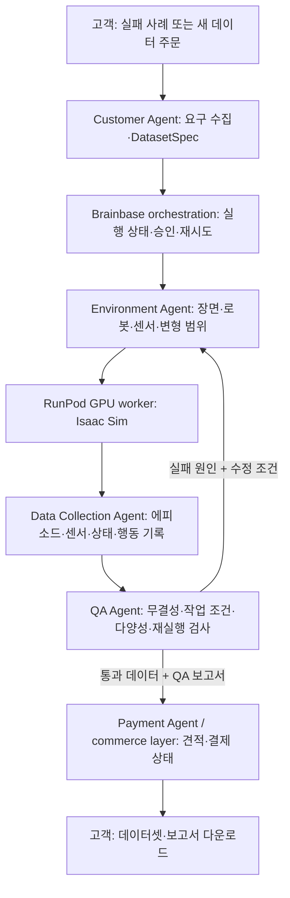

# Agriphilo — 주문형 로봇 데이터 파일럿

> 상태: 2026-09-28 해커톤 기획안. 고객, 데이터 품질, 시뮬레이터 실행, 결제는 아직 검증 전이다.

## 1. 한 줄 설명

로봇 팀이 **실패 조건 또는 필요한 데이터 조건**을 자연어로 주문하면, Agriphilo가 시뮬레이션 장면을 만들고 로봇 행동 에피소드를 수집·검사해 **데이터셋과 QA 보고서**를 납품한다.

**초기 고객 가설:** 온실 수확 로봇을 개발하며 특정 상황의 실패를 재현하거나 학습 데이터를 추가해야 하는 로봇 회사·연구팀. 현재 실제 접촉 가능한 고객은 없으며, 해커톤 데모의 고객 요청은 가상 사례다. 첫 유료 상품 가설은 **실패 시나리오 평가 + 해당 조건의 데이터 생성**을 묶은 파일럿이다.

## 2. Problem statement

온실 로봇 팀은 잎 가림, 조명 변화, 과실 위치 차이처럼 드물지만 중요한 조건의 데이터를 반복해서 얻기 어렵다. 원하는 조건을 정한 뒤에도 장면·로봇·센서를 설정하고, 시뮬레이션을 실행하고, 유효하지 않은 에피소드를 걸러 데이터 형식을 맞추는 작업이 필요하다. 현재 이 과정을 고객이 직접 수행한다고 가정한다. **이 작업의 실제 비용과 구매 의사는 고객 인터뷰로 확인해야 한다.**

고객의 질문은 두 가지다.

1. **Failure mode:** “이 영상/로그에서 실패한 조건을 다시 만들어 평가하고, 그 조건의 데이터를 더 줄 수 있나?”
2. **Generation mode:** “이 로봇·작업에 필요한 시뮬레이션 데이터를 처음부터 설계하고 만들어 줄 수 있나?”

## 3. Solution과 해커톤 범위

하나의 온실 장면과 하나의 데이터 형식을 공유하면서 **두 주문 방식을 모두** 보여준다. 고객 요청을 구조화한 `DatasetSpec`을 만든 뒤, 장면 생성 → 에피소드 실행 → QA → 납품 견적까지 연결한다. 제품의 산출물은 이미지 묶음이 아니라 **영상, 로봇 상태·행동, 성공/실패 라벨, 생성 조건, QA 결과가 연결된 에피소드**다.

### 고정 데모 시나리오

| 항목 | 이번 데모의 결정 |
| --- | --- |
| 산업 | 온실 농업 |
| 고객이 원하는 최종 작업 | 토마토 수확 |
| 데모 로봇 | Isaac Sim 예제가 있는 Franka Panda 팔 + 그리퍼. 실제 고객 하드웨어의 대리 모델 |
| 검증 가능한 데모 작업 | 잎에 일부 가려진 토마토를 보고 수확 직전 자세(pregrasp)까지 접근 |
| 변형 축 | 잎 가림, 과실 위치, 조명, 카메라 위치 |
| 제외 범위 | 줄기 절단, 과실 분리·손상에 대한 실제 물리 정확도 주장, 실로봇 성능 보증 |

Failure mode는 고객 영상/로그에서 **관찰 가능한 조건을 추출해 재구성**한다. 단일 영상에서 실제 온실 전체를 자동·정확하게 복원했다고 주장하지 않는다. Generation mode는 같은 장면의 파라미터 범위를 무작위화한다.

## 4. 제품 흐름과 아키텍처

Brainbase에서 다섯 에이전트의 입력·출력과 흐름을 정의하고, Cloudflare sandbox는 요청 처리·오케스트레이션에 사용한다. **GPU 시뮬레이션은 별도 RunPod Pod**에서 수행한다. 에이전트가 코드를 직접 무제한 생성해 실행하기보다, 제한된 장면 템플릿과 검증된 파라미터를 선택해 worker job으로 전달하는 설계를 우선한다.

| 구성 요소 | 책임 | 최소 산출물 |
| --- | --- | --- |
| Customer Agent | 모호한 자연어를 확인 질문과 `DatasetSpec`으로 변환. 간단한 데이터 구성 계획도 여기 포함 | 작업, 로봇, 두 주문 방식, 변형 범위, 에피소드 수, 출력 형식, 성공 조건 |
| Environment Agent | Isaac Sim/MuJoCo 선택, 장면·로봇·카메라·조명·과실 배치 | 버전이 기록된 장면 파일과 실행 설정 |
| Data Collection Agent | seed별 rollout과 센서·행동 동기화 | episode별 RGB/depth/segmentation, joint state, action, object pose, timestamps |
| QA Agent | 손상·누락·비정상 궤적, 작업 성공, 분포·중복, 재현성 검사 | episode별 pass/fail 사유와 전체 QA 보고서 |
| Payment Agent | 견적·주문·결제 상태·데이터 접근 처리 | 파일럿 견적과 데모 checkout 상태. 실제 결제 연동은 후속 단계 |

**에이전트 수 결정:** 해커톤은 위 5개로 충분하다. 별도의 Dataset Planner는 Customer Agent의 계획 단계에 포함하고, 재시도·상태 관리는 Brainbase orchestration이 맡는다. 제품 피치에서는 에이전트 개수보다 “요구 → 검증된 데이터 납품” 결과를 보여준다.

### 핵심 데이터 계약

`DatasetSpec`: `mode`, `robot`, `task`, `scene_template`, `reference_failure`, `randomization`, `episode_count`, `sensors`, `success_rule`, `output_format`.

`Episode`: `episode_id`, `seed`, `scene_version`, `simulator_version`, `sim_step`, `sim_time`, `rgb`, `depth`, `segmentation`, `joint_state`, `action`, `target_pose`, `contacts`, `success`, `failure_reason`. 모든 프레임의 영상·상태·행동을 동일한 episode와 시뮬레이션 단계로 연결한다. 내부 저장은 HDF5, 고객용 포맷 변환은 후속 선택이다.

## 5. 시뮬레이터와 화면을 함께 보는 방식

**Isaac Sim이 주 엔진**이다. 온실 영상, 깊이, 객체 분할, 조명·가림 변형을 보여줘야 하기 때문이다. **MuJoCo는 빠른 운동학·충돌 로직 검증 또는 Isaac 기동 지연 시 대체 데모**로 쓴다. 두 엔진의 접촉·성공률이 같다고 가정하지 않는다.

NVIDIA Isaac Sim 6.1 문서의 최소 사양은 RTX 4080급/VRAM 16GB, 호스트 RAM 32GB, SSD 50GB다. 이번 장면과 **GUI 화면 공유**를 위해 목표 Pod는 **RTX 4090 24GB 1장, 호스트 RAM 32GB 이상, 컨테이너 디스크 100GB**로 잡는다. 공식 `nvcr.io/nvidia/isaac-sim:6.1.0` 컨테이너에서 호환성 검사와 간단한 장면 출력을 먼저 확인한다. 호스트 드라이버와 실제 실행 시간은 Pod에서 검증해야 한다. A100/H100은 RT Core가 없어 Isaac Sim 렌더링용으로 선택하지 않는다.

**GUI 요구:** 고객과 팀이 Isaac Sim 장면을 브라우저에서 보며 카메라·토마토·잎 위치를 확인해야 한다. NVIDIA 기본 WebRTC 방식은 TCP 49100과 UDP 47998, 컨테이너 host networking이 필요하다. RunPod의 일반 HTTP 접속과 바로 호환된다고 가정할 수 없다. RunPod에서 GUI를 쓴다면 가상 디스플레이 + noVNC를 HTTP 포트로 제공하는 구성을 별도 스모크 테스트한다. 이것이 실패해도 headless 결과 이미지·영상은 생성 가능하지만, **실시간 GUI 목표는 미달**이라고 표시한다.

**기존 저장소 제약:** 계정의 Network Volume `p2p558yxuv`는 EU-NL-1의 250GB다. 2026-09-28 확인 시 그 센터에는 Isaac Sim에 적합한 RTX 재고가 없고 H100만 표시됐다. Network Volume은 같은 데이터센터의 Pod에 연결해야 하므로, 다른 지역의 RTX Pod에 이 볼륨을 그대로 붙일 수 없다. 기존 볼륨의 파일 내용도 아직 확인되지 않았다. 새 Pod·볼륨 생성 및 비용 발생은 별도 실행 결정이 필요하다.

## 6. QA 기준과 구현 소프트웨어

| 단계 | 구현 | 데모에서 확인할 것 |
| --- | --- | --- |
| 센서 데이터 | Isaac Sim Replicator `BasicWriter` | RGB, depth, semantic/instance segmentation, 목표 과실 ID |
| 궤적 기록 | Isaac Sim Python API + `h5py` | 관절 위치·속도, 행동, 목표 pose, 시간·step 정렬 |
| 구조 검사 | Python `NumPy` + `Pydantic` | 파일·프레임 누락, 배열 shape/dtype, NaN, 시간 역행, 행동 범위 |
| 작업 검사 | 시뮬레이터 pose·contact 정보와 명시적 Python 규칙 | 제한 시간 내 목표 근접, 금지 충돌 없음, 실패 원인 분류 |
| 다양성 검사 | `pandas`/NumPy 집계 | 가림·조명·과실 위치 구간별 건수와 성공률, 중복 seed |
| 재현성 검사 | seed와 scene version으로 일부 에피소드 재실행 | 동일 입력으로 결과를 재현할 수 있는지 |

QA의 **pass**는 위 계약과 시뮬레이션 내부 성공 조건을 충족했다는 뜻이다. 식물 손상이나 실제 로봇 학습 효과를 증명하지 않는다. 작은 행동 모방 모델의 빠른 학습은 파일을 학습 파이프라인이 읽는지 확인하는 보조 실험일 수 있으나, 품질 인증의 근거로 쓰지 않는다. 제품 단계에서는 `real-only`와 `real + synthetic` 모델을 **서로 다른 식물·장면의 실데이터 테스트**에서 비교해야 한다.

## 7. 해커톤 실행 순서와 통과 기준

1. **11시까지 브레인스토밍 종료:** 위 고객·구매 가설과 고정 장면, 두 주문 방식을 확정한다.
2. **인프라 스모크:** 호환 GPU의 RunPod Pod에서 Isaac Sim 호환성 검사 → Franka 장면 1회 실행 → RGB와 궤적 파일 생성. GUI가 목표이므로 noVNC 화면 접속도 별도로 확인한다.
3. **두 주문 입력:** 실패 조건 입력 1개와 새 데이터 주문 1개를 같은 `DatasetSpec`으로 수렴시킨다.
4. **작은 실제 배치:** 각 모드에서 에피소드를 소량 생성하고 QA pass/fail 사유를 실제 출력에서 계산한다. 화면의 수량·성공률·가격은 하드코딩된 성과처럼 제시하지 않는다.
5. **데모 화면:** 요청 → 장면 미리보기/실행 → 생성된 영상·에피소드 → QA 보고서 → 파일럿 견적 순으로 보여준다.

**핵심 통과 기준:** 고객 요청 하나가 실제 생성된 장면, 저장된 에피소드, 근거가 있는 QA 결과까지 연결된다. 두 모드 모두 같은 파이프라인을 통과한다. GUI 연결 성공 여부와 실시간으로 확인한 범위를 별도로 표시한다.

## 8. 제품화 경로와 가장 싼 검증

| 단계 | 확인할 가설 | 산출물 |
| --- | --- | --- |
| 해커톤 | 두 주문 방식을 하나의 자동 파이프라인으로 처리할 수 있는가 | 작동하는 온실 데모와 QA 보고서 |
| 첫 고객 인터뷰 | 로봇 팀이 실제로 돈과 시간을 쓰는 실패 조건은 무엇인가 | 고객이 제공한 영상/로그, 구매 결정 기준, 현재 대안의 비용 |
| 유료 파일럿 | 재현·평가와 조건별 데이터 묶음에 비용을 지불하는가 | 고객 로봇/카메라에 맞춘 장면, 납품 계약, 재현 가능한 데이터 |
| 성능 검증 | 합성 데이터가 실제 작업 성능을 높이는가 | 실데이터 홀드아웃과 가능하면 실로봇의 비교 실험 |
| 제품화 | 고객별 제작을 반복 가능한 서비스로 줄일 수 있는가 | 장면 템플릿, 데이터·QA 계약, 작업 큐, 결제·전달 자동화 |

**가장 싼 반증:** 온실 로봇 팀에 실제 실패 영상과 현재 데이터 확보 방법을 요청하고, 실패 재현·QA 보고서 샘플에 대한 **파일럿 구매 의사와 성공 판정 기준**을 확인한다. 고객이 이미 더 싸고 빠르게 해결하고 있거나 합성 데이터의 활용 조건을 제시하지 못하면 제안을 수정한다.

## 참고 자료

- [해커톤 Notion 페이지](https://app.notion.com/p/Cloudfare-hackarthon-3e92a46dc68c80d29be1c1f6f8db948a?source=copy_link)
- [NVIDIA Isaac Sim 요구사항](https://docs.isaacsim.omniverse.nvidia.com/latest/installation/requirements.html), [컨테이너 설치](https://docs.isaacsim.omniverse.nvidia.com/latest/installation/install_container.html), [Livestream 요구사항](https://docs.isaacsim.omniverse.nvidia.com/latest/installation/manual_livestream_clients.html)
- [Isaac Sim Replicator](https://docs.isaacsim.omniverse.nvidia.com/latest/replicator_tutorials/tutorial_replicator_isaac_snippets.html), [MuJoCo Python 설치](https://mujoco.readthedocs.io/en/stable/python.html)
