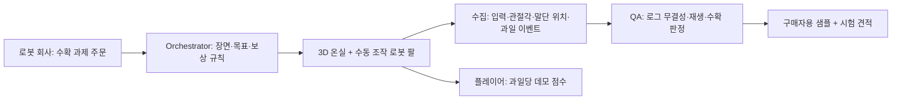

# Agriphilo — 3시간 3D 게임 데모 계획

> 2026-09-28 최신 결정: 사람 플레이어가 가상 로봇 팔을 직접 조작해 토마토를 수확한다. 이 문서는 작업 계획이며, 3D 데모의 실행·품질 검증 상태는 별도로 확인한다. 원래 Isaac Sim 계획은 [docs/plan_isaac_2026-09-28.md](docs/plan_isaac_2026-09-28.md)에 보관했다.

## 한 줄 가설

로봇 회사가 원하는 작업을 **게임형 원격조작 과제**로 만들고, 사람이 플레이하면서 남긴 관절 궤적과 성공·실패 기록을 검수해 공급한다. 플레이어에게는 과일당 보상/점수를 보여준다. 로봇 회사의 구매 의사, 실제 로봇 작업으로의 전이, 유효 궤적당 비용이 기존 수집 방법보다 낮은지는 아직 검증 전이다.

## 3시간 안에 보여줄 단일 게임

3D 온실 장면에 **토마토 3개와 관절이 있는 가상 로봇 팔 1개**만 둔다. 사용자는 키보드/슬라이더로 팔 관절과 그리퍼를 조작한다. 그리퍼가 과일 가까이에서 닫히면 과일 1개를 수확하고 점수가 늘어난다. 게임 규칙은 거리와 그리퍼 상태로 판정한다. 물리 접촉·과일 손상·실로봇 성능으로 해석하지 않는다.

**구현 위치:** 현재 저장소 `/Users/jeff/project/cloudfare_0928`에서 개발하고, 기존 Python 웹 서버의 `/game`에서 로컬 브라우저로 시연한다. [Three.js 설치 문서](https://threejs.org/manual/pages/installation.html)의 빌드 없는 모듈 방식을 사용하고, 온실·팔·토마토는 기본 3D 도형으로 만든다. RunPod와 Isaac Sim GUI는 핵심 경로에서 제외한다.

## 반드시 남길 데이터

회차 메타데이터: `episode_id`, `seed`, `scene_version`, `robot_model_version`, `control_mapping`, `task_rule`, `player_id`(데모에서는 익명 임시 ID).

각 조작 tick: `timestamp`, `step`, `input_action`, `joint_angles_rad`, `gripper_open`, `end_effector_pose`, `fruit_states`, `score`, `event`. 토마토별 `fruit_id`와 수확 시각을 남긴다. 화면 캡처/재생 자료는 같은 tick에 연결한다. **재현성은 seed만으로 검증할 수 없고, seed + 저장된 사람 입력을 순서대로 다시 실행해야 한다.**

기존 `agriphilo/sim/mock.py`의 관절값은 스크립트로 만든 값이므로 새 데모 데이터로 쓰지 않는다. 기존 Python QA/HDF5는 Franka 7관절·센서 계약을 전제로 하므로, 이번 브라우저 3D 회차에는 별도 JSON 계약과 검사를 사용한다. 발표에서는 이를 **가상 팔의 기구학 기록**이라고 표시한다.

## 180분 우선순위

| 시간 | 만들 것 | 통과 기준 |
| --- | --- | --- |
| 0–20분 | Three.js 빈 온실, 카메라, 로봇 관절 계층 | 로컬 브라우저에서 3D 장면이 뜸 |
| 20–75분 | 수동 관절/그리퍼 조작, 토마토 1개 수확 | 사람이 조작해 실제로 점수 1회 증가 |
| 75–115분 | 과일 3개, 입력·관절·말단·수확 로그, JSON 다운로드 | 수확 이벤트와 관절각이 같은 tick에 기록됨 |
| 115–145분 | seed + 입력 재생 QA, 실패 이유, 데모 점수/시험 견적 | 정상 회차 통과·변조 로그 실패 |
| 145–180분 | 브라우저 리허설·화면 캡처·데모 문구 정리 | 1회 수확을 끊김 없이 재시연 |

**중단 기준:** 75분에 3D 수확 1회가 안 되면 과일 1개와 관절 2개만 남긴다. 115분에 로깅이 안 되면 연출과 에셋 작업을 중단하고 수확 1회 + 실제 관절 로그 + 다운로드를 먼저 완성한다. 결제는 실제 돈 이동 없이 `TEST MODE` 화면만 둔다.

## 사업 가설의 가장 싼 검증

**구매자 측:** 로봇 회사 3곳에 이 JSON 샘플을 보여주고, 그들이 실제로 필요한 관절 수·제어 주기·카메라·접촉/힘·로봇 모델·포맷을 묻는다. 샘플을 학습/평가 파이프라인에 넣어 볼 의향과 유효 회차당 지불 상한을 확인한다.

**공급 측:** 플레이어 5명에게 같은 과제를 주고 수확 성공률, 소요 시간, QA 통과율, 유효 회차당 보상과 운영 비용을 잰다. 시급과 비교할 때는 **유효한 데이터 1건당 총비용**으로 비교한다. 수확당 현금 보상이나 수익 분배는 고객 수요·품질·법적 요건이 확인된 다음 단계다.

유사 선례가 이미 있다. [Stanford RoboTurk](https://roboturk.stanford.edu/)는 대규모 사람 원격조작 데이터 수집을 보였고, [FrodoBots](https://www.frodobots.ai/)는 게임과 로봇 원격조작을 결합한다. 차별화는 “게임” 자체보다 **고객이 지정한 작업, 로봇에 맞는 데이터 계약, QA를 통과한 궤적의 단가**에서 검증해야 한다.

## GUI 전환 근거

[RunPod 문서](https://docs.runpod.io/pods/configuration/expose-ports)는 Pod 외부 UDP 연결을 지원하지 않는다고 명시한다. [NVIDIA Isaac Sim WebRTC 문서](https://docs.isaacsim.omniverse.nvidia.com/latest/installation/manual_livestream_clients.html)는 영상 전송에 UDP 47998을 요구한다. 현재 3시간 데모에서 Isaac GUI를 핵심 경로로 삼기 어렵다는 판단의 근거다.
